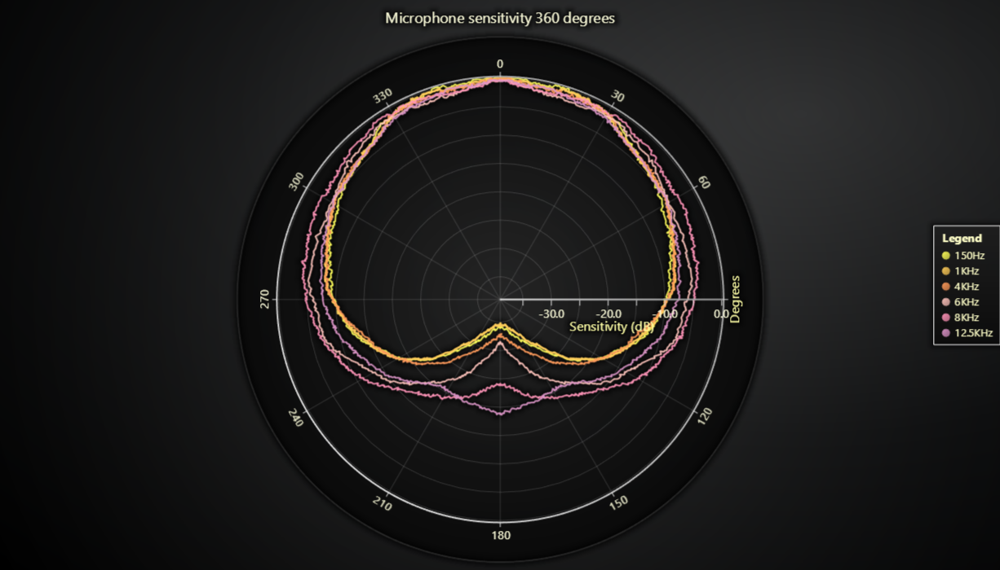

# Polar Microphone Sensitivity JavaScript Chart



This demo application belongs to the set of examples for LightningChart JS, data visualization library for JavaScript.

LightningChart JS is entirely GPU accelerated and performance optimized charting library for presenting massive amounts of data. It offers an easy way of creating sophisticated and interactive charts and adding them to your website or web application.

The demo can be used as an example or a seed project. Local execution requires the following steps:

-   Make sure that relevant version of [Node.js](https://nodejs.org/en/download/) is installed
-   Open the project folder in a terminal:

          npm install              # fetches dependencies
          npm start                # builds an application and starts the development server

-   The application is available at _http://localhost:8080_ in your browser, webpack-dev-server provides hot reload functionality.


## Description

This example showcases a simple Polar Chart with five Line Series.

Polar Charts are used for visualizing data relationships in terms of radiuses and angles.

## Polar coordinate system and PolarLineSeries

```typescript
{
    // Data point angle as degrees [0, 360].
    angle: 0,
    // Data point position on the *Amplitude Axis*. Determines its location between the Charts origin and outer edge.
    amplitude: 50
}
```

_PolarLineSeries_ connects a list of such _PolarPoints_ with a continuous line.

[//]: # 'IMPORTANT: The assets will not show before README.md is built - relative path is different!'


## PolarRadialAxis

The coordinate system can be rotated with methods of \*PolarRadialAxis\*\*.

```typescript
// Configure Polar Radial Axis.
const radialAxis = polar
    .getRadialAxis()
    // 0 = North
    .setRotation(90)
    // Clockwise direction.
    .setInverted(true)
```

## PolarAmplitudeAxis

Similarly, the visible range of amplitude values can be configured with methods of _PolarAmplitudeAxis_. The default configuration is to fit

```typescript
const amplitudeAxis = polar
    .getAmplitudeAxis()
    // Set amplitude interval explicitly.
    // [-39 dB, 0 dB]
    .setInterval({ start: -39, end: 0, stopAxisAfter: false })
    .setTitle('Sensitivity (dB)')
```


## API Links

* [Polar chart]
* [Polar line series]
* [Polar radial axis]
* [Polar amplitude axis]
* [Polar point]


## Support

If you notice an error in the example code, please open an issue on [GitHub][0] repository of the entire example.

Official [API documentation][1] can be found on [LightningChart][2] website.

If the docs and other materials do not solve your problem as well as implementation help is needed, ask on [StackOverflow][3] (tagged lightningchart).

If you think you found a bug in the LightningChart JavaScript library, please contact support@lightningchart.com.

Direct developer email support can be purchased through a [Support Plan][4] or by contacting sales@lightningchart.com.

[0]: https://github.com/Arction/
[1]: https://lightningchart.com/lightningchart-js-api-documentation/
[2]: https://lightningchart.com
[3]: https://stackoverflow.com/questions/tagged/lightningchart
[4]: https://lightningchart.com/support-services/

© LightningChart Ltd 2009-2022. All rights reserved.


[Polar chart]: https://lightningchart.com/js-charts/api-documentation/v4.2.0/classes/PolarChart.html
[Polar line series]: https://lightningchart.com/js-charts/api-documentation/v4.2.0/classes/PolarLineSeries.html
[Polar radial axis]: https://lightningchart.com/js-charts/api-documentation/v4.2.0/interfaces/PolarAxisRadial.html
[Polar amplitude axis]: https://lightningchart.com/js-charts/api-documentation/v4.2.0/classes/PolarAxisAmplitude.html
[Polar point]: https://lightningchart.com/js-charts/api-documentation/v4.2.0/interfaces/PolarPoint.html

